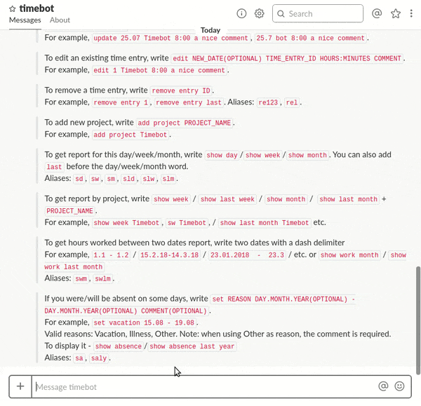
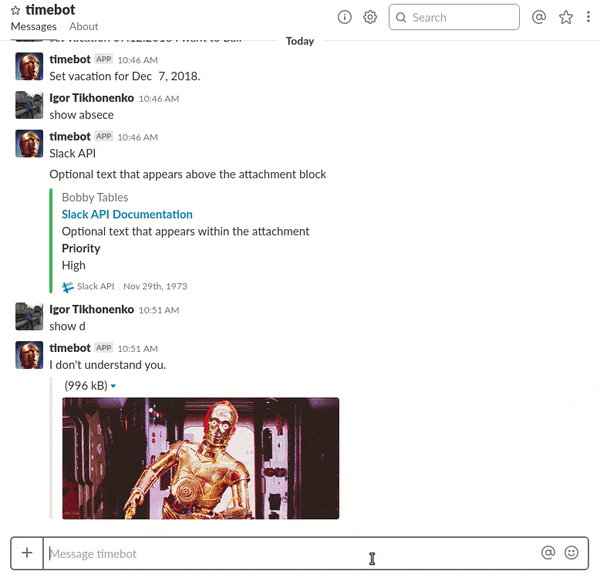
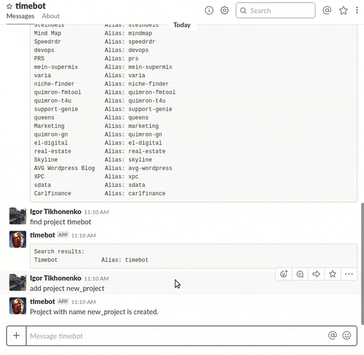
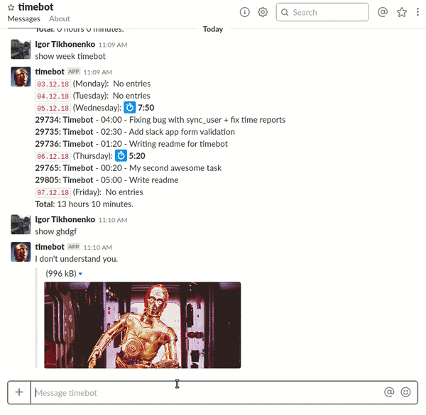

<h1 align="center">Slack Time-Tracking Bot</h1>

<p align="center">
 
</p>

**Timebot** is a time-tracking system allowing to enter the number of hours spent on a particular project and monitor a development workflow as a whole. The information will reflect in each member’s timesheet, which can be later viewed and edited.

## Сore Functionality
##### 1. Time tracking

<p align="center">
 
</p>

<h6 align="center">OR</h6>

<p align="center">
  
</p>

##### 2. Absences

<p align="center">
 
</p>

##### 3. Reports

<p align="center">
 
</p>

##### 4. Projects

<p align="center">
 
</p>

## All available commands

| Commands                                                                           | Description                                                  |
| ---------------------------------------------------------------------------------- | ------------------------------------------------------------ |
| `help`                                                                             | print help.                                                  |
| `projects`                                                                         | print all available projects projects.                       |
| `find project SEARCH_QUERY`                                                        | find specific project.                                       |
| `PROJECT_NAME HOURS:MINUTES COMMENT`                                               | log time.                                                    |
| `/logtime`                                                                         | log time via interective dialog.                             |
| `edit NEW_DATE(OPTIONAL) TIME_ENTRY_ID HOURS:MINUTES COMMENT`                      | edit an existing time entry.                                 |
| `update(OPTIONAL) DAY.MONTH.YEAR PROJECT_NAME HOURS:MINUTES COMMENT`               | create an entry for the specific date.                       |
| `add project PROJECT_NAME`                                                         | add new project.                                             |
| `show day`/`show week`/`show month`                                                | get report for this day/week/month.                          |
| `show absence`/`show absence last year`                                            | display absences.                                            |
| `set REASON DAY.MONTH.YEAR(OPTIONAL) - DAY.MONTH.YEAR(OPTIONAL) COMMENT(OPTIONAL)` | if you were/will be absent on some days.                     |

## API Documentation
The application also provides comprehensive API documentation for integrating client applications. [Full docs can be found here](https://gitlab.codica.com/codica2/timebot/blob/feature/readme/docs.md)

## How to install for your team?
### Requirements
  - `rails 5.0`
  - `ruby 2.3.3`
  - `PostgresQL`

### Getting started
**Step 1:** Clone the app

```shell
 git clone git@gitlab.codica.com:codica2/timebot.git
 cd timebot
```
**Step 2** Add environment variables to **.env** (*create file if don't exist*)
```
 SECRET_KEY_BASE=`secret_key_base`
 SLACK_TOKEN=`slack_token`
 TIMEBOT_APP_TOKEN=`slack_timebot_app_token`
 TRELLO_MEMBER_TOKEN=`member_token`
```
1. [How to get](#user-content--secret-key-base) `secret_key_base`
2. [How to get](#user-content--adding-slack-bot-integration) `slack_token`
3. [How to get](#user-content--building-slack-app) `slack_timebot_app_token`
4. [How to get](#user-content--trello-integration) `member_token`

**Step 3:**  Add config files:
```shell
 mv config/database.yml.example config/database.yml
```
**Step 4:**  Install the app's dependencies:

```shell
 bundle install && bundle exec rake db:create && bundle exec rake db:migrate
```

### Integrations
---

#### [](#slack_timebot_app_token) Building Slack App

  1 Go to [Slack API](http://https://api.slack.com "Slack API")

  2 Click **Start Building** button

  3 In the dialog that opens, select the name of your application and the workspace in which your application should work.

  4 After successful creation:
  - Go to the slash command tab
  - Press **Add new command** button
  - Fill Command field with **/logtime**
  - Fill Request URL with **https://your_domain_name.com/api/v1/slack/command**
  - Press save

  5 Go to Interactive Components tab
  - Fill Request URL field with **https://your_domain_name.com/api/v1/slack/submission**
  - Press save

  6 Add Bot user on **Bot users** tab

  7 Got to OAuth & Permissions tab

  - Press **Install App to Workspace** button
  - Copy `Bot User OAuth Access Token` and paste to **.env** `slack_timebot_app_token=`

#### [](#slack_token) Adding Slack Bot integration

  1 Choose your workspace

  2 Add configuration

  3 Choose a name for your slack bot

  4 Get your `slack_token`

#### [](#member_token) Trello integration

  [Hot to get trello token read here](https://developers.trello.com/v1.0/reference#introduction)

#### [](#secret_key_base) Secret key base

  Just run `rake secret`

## License
Timebot is Copyright © 2015-2018 Codica. It is released under the [MIT License](https://opensource.org/licenses/MIT).

## About Codica

[](https://www.codica.com)

Timebot is maintained and funded by Codica. The names and logos for Codica are trademarks of Codica.

We love open source software! See [our other projects](https://github.com/codica2) or [hire us](https://www.codica.com/) to design, develop, and grow your product.
